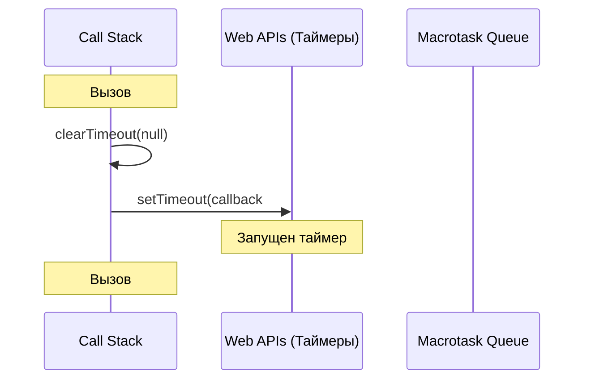
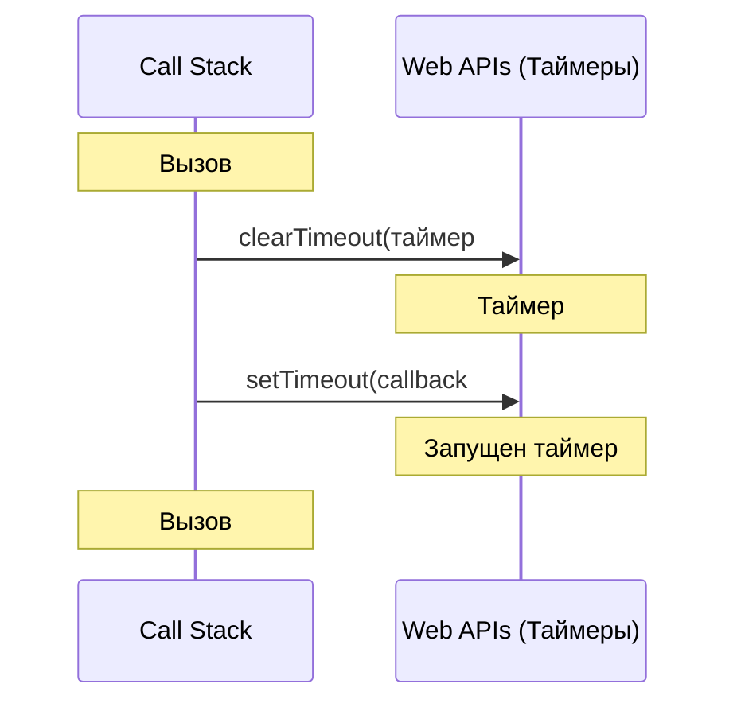

# Разбор алгоритма Debounce и Big O

---

## Что такое Debounce?

**Debounce** — техника управления частотой вызовов функции.

Если debounced-функцию вызывают несколько раз подряд, реальный вызов `func` произойдёт только один раз — через `wait` мс
**после последнего** вызова.

**Аналогия из жизни:** кнопка «Держать дверь открытой» в лифте. Пока кто-то её нажимает — дверь не закрывается. Только
после того, как перестали нажимать и прошло X секунд — дверь закрывается (func вызывается).

---

## Ключевые концепции

| Концепция               | Роль в debounce                                                              |
| ----------------------- | ---------------------------------------------------------------------------- |
| **Замыкание (closure)** | `timeoutID` живёт между вызовами — каждый новый вызов видит один и тот же ID |
| **`setTimeout`**        | Планирует отложенный вызов `func`                                            |
| **`clearTimeout`**      | Отменяет предыдущий таймер — сбрасывает отсчёт                               |
| **`this`**              | Должен быть таким же, как у вызывателя — передаётся через `apply`            |
| **`...args`**           | Берутся из **последнего** вызова (не первого)                                |

---

## TypeScript-типизация

Дебаунс — одна из наиболее интересных функций с точки зрения статической типизации. Разберём её архитектуру в TypeScript до мельчайших деталей.

### Разбор строгой версии (через Generic по всей функции)

```ts
export function debounce<T extends (...args: any[]) => any>(
  func: T,
  wait: number = 0,
): (...args: Parameters<T>) => void
```

#### 1. Generic-ограничение `T extends (...args: any[]) => any`
`T` — это generic, представляющий тип передаваемой оригинальной функции.
*   **Зачем нужно ограничение (`extends`)?** Оно гарантирует, что в `debounce` передадут исключительно функцию. Если попытаться передать число или строку, TS выдаст ошибку сборки.
*   **Что означают `...args: any[]` и `any` на конце?**
    *   `...args: any[]` — это **первый оператор три точки (Rest-параметр на уровне типов)**. Он указывает, что оригинальная функция может принимать любое количество аргументов любых типов.
    *   Возвращаемый тип `=> any` позволяет нам принимать функции, возвращающие абсолютно любые данные (`string`, `Promise`, `void`). Мы пишем `any` (или `unknown`), чтобы разрешить дебаунсить функции с любым возвращаемым типом.

#### 2. Возвращаемый тип `(...args: Parameters<T>) => void`
*   `(...args: Parameters<T>)` — это **второй оператор три точки (Rest-параметр в сигнатуре возвращаемой функции)**. Он гарантирует, что возвращаемая обёртка примет ровно те же аргументы, что и оригинальная функция `T`.
*   **Служебный тип `Parameters<T>`:** Извлекает типы аргументов из функции `T` в виде кортежа (tuple). Например, если `T` — это `(q: string, limit: number) => void`, то `Parameters<T>` вернет тип `[string, number]`.
*   **Почему возвращается `void` (а не `any` или `ReturnType<T>`)?**
    *   Возвращаемая дебаунс-обёртка выполняется **асинхронно** (в будущем тике Event Loop через `setTimeout`).
    *   Когда вы вызываете дебаунс-функцию:
        ```ts
        const dbClick = debounce(click, 1000);
        dbClick(); // Вызов завершается синхронно и мгновенно
        ```
        В этот момент оригинальная функция еще не сработала — она выполнится только через секунду.
    *   Следовательно, вернуть результат оригинальной функции в момент вызова обёртки **физически невозможно**. Она всегда возвращает `undefined` (что в TS описывается типом `void`).

---

### Глубокий разбор: три оператора «три точки» (`...`)

В коде решения `debounce3` оператор `...` встречается трижды. Несмотря на внешнюю схожесть, они выполняют абсолютно разные задачи на уровне типов и на уровне исполнения JS:

1.  **В строке generic-ограничения: `<T extends (...args: any[]) => any>`**
    *   **Где:** В ограничении дженерика (Generic Constraint).
    *   **Зачем:** Это описание сигнатуры типа (на уровне типов). Запись `...args: any[]` означает: «функция, которая принимает любое количество аргументов любого типа». Это позволяет нам передавать в `debounce` абсолютно любую функцию (хоть без аргументов, хоть с пятью).
2.  **В строке сигнатуры возвращаемой функции: `): ((...args: Parameters<T>) => void) => {`**
    *   **Где:** В описании возвращаемого типа функции `debounce3`.
    *   **Зачем:** Это тоже описание типа (Rest Parameter в сигнатуре типа). Она говорит TS: «возвращаемая функция примет аргументы ровно в том количестве и тех типов, которые мы вытащили из оригинальной функции `T` с помощью `Parameters<T>`».
3.  **В объявлении возвращаемой функции: `return function (this: any, ...args: Parameters<T>) {`**
    *   **Где:** В реальном объявлении функции (JS Runtime + TS-тип).
    *   **Зачем:**
        *   **В JS (Rest Parameter):** Собирает все переданные при вызове аргументы в реальный массив с именем `args`. Без этого мы не смогли бы сделать `func.apply(this, args)`, ведь `apply` требует массив аргументов.
        *   **В TS:** Явно типизирует этот созданный массив как кортеж `Parameters<T>`.

---

### Зачем явно типизировать аргументы во внутреннем `return function`?

Если вы уже написали тип возвращаемого значения в строке сигнатуры (`: ((...args: Parameters<T>) => void)`), то TypeScript умеет выводить типы параметров возвращаемой функции сверху вниз (это называется **Contextual Typing**).

То есть технически вы могли бы написать просто:
```ts
return function (this: any, ...args) { ... }
```
TypeScript автоматически догадался бы, что `args` имеет тип `Parameters<T>`.

Однако есть важные нюансы, из-за которых пишется явная типизация:
1.  **Проблема с `this`:** Если в проекте включена строгая проверка `"noImplicitThis": true` in `tsconfig.json`, TypeScript выдаст ошибку на использование `this` внутри функции без явного указания `this: any` в аргументах. Сам по себе контекст `this` автоматически сверху вниз для обычной внутренней функции выводится неохотно.
2.  **Читаемость кода:** Явное указание `...args: Parameters<T>` делает код самодокументируемым. Разработчик сразу видит, что `args` привязаны к типам исходной функции.
3.  **Безопасность при рефакторинге:** Если кто-то решит убрать или изменить явную аннотацию возвращаемого типа функции `debounce3` в сигнатуре (положившись на автовывод типов), то при отсутствии типизации во внутреннем `return` типы аргументов `args` превратятся в неявные `any[]`, и типизация всего дебаунса сломается. Явная типизация внутри надежно защищает от этого.

---

### Сравнение подходов: Generic по всей функции vs Generic по аргументам

| Подход | Как выглядит сигнатура | Плюсы | Минусы |
| :--- | :--- | :--- | :--- |
| **Generic по функции** (применен здесь) | `<T extends (...args: any[]) => any>` | Легко вытащить возвращаемый тип оригинала через `ReturnType<T>` | Требуется использовать `Parameters<T>` для получения типов аргументов |
| **Generic по аргументам** (применен в `throttle`) | `<T extends any[]>` | Очень простой синтаксис аргументов обёртки: `...args: T` | Сложнее восстановить тип возвращаемого значения оригинала |

---

### Почему в дженерике `any`, а не `unknown`?

В современном TypeScript рекомендуется избегать `any` и использовать безопасный тип `unknown`. Однако в случае с ограничениями дженериков для функций (`extends (...args: any[]) => any`) использование `any` — это **единственный рабочий вариант**.

#### 1. Проблема с аргументами: `any[]` vs `unknown[]` (Контравариантность)

Параметры функций в TypeScript ведут себя **контравариантно** (то есть "наоборот" по сравнению с обычными переменными при проверке на совместимость):
*   Любой конкретный тип (например, `string`) является подтипом `unknown` (строку можно записать в `unknown`).
*   Но для функций всё строго наоборот: если функция ожидает на вход `string` (например, `(q: string) => void`), вы **не можете** безопасно передать ей `unknown` (так как внутри функции будут вызываться строковые методы вроде `.toLowerCase()`, которые у `unknown` отсутствуют).
*   Поэтому тип `(q: string) => void` **нельзя записать** в тип `(...args: unknown[]) => void`.

Если в ограничении дженерика написать `T extends (...args: unknown[]) => any`, TypeScript разрешит передавать в `debounce` только те функции, аргументы которых типизированы как `unknown` или `any`. Любая обычная функция вызовет ошибку компиляции:
```ts
function search(query: string) {}

// ❌ Ошибка: string не совместим с unknown
debounce(search, 300); 
```

**Почему `any[]` здесь работает?**
Тип `any` отключает строгую проверку типов в этой позиции. Запись `(...args: any[])` сообщает TypeScript: «здесь может быть функция с абсолютно любыми аргументами, не проверяй их совместимость с `unknown` на этапе сопоставления дженерика».

#### 2. Что насчет возвращаемого значения: `=> any` vs `=> unknown`?

Для возвращаемого значения (`any` на конце сигнатуры) ситуация мягче:
*   Поскольку возвращаемое значение функции находится в **ковариантной** (прямой) позиции, любой тип (например, `Promise<User>`) можно безопасно записать в `unknown`.
*   Поэтому теоретически запись `T extends (...args: any[]) => unknown` скомпилировалась бы.
*   Однако использование `any` на конце является общепринятым стандартом для описания абстрактных функций в ограничениях TS, так как оно гарантирует 100% совместимость и не требует от компилятора лишних проверок при работе со сложными типами.

---

### `ReturnType<typeof setTimeout>`

**Кросс-платформенный тип ID таймера.**

```ts
// Браузер:  setTimeout возвращает number
// Node.js:  setTimeout возвращает NodeJS.Timeout (объект)

// Поэтому НЕ пишем:
let timeoutID: number | null = null // ❌ сломается в Node.js

// А пишем:
let timeoutID: ReturnType<typeof setTimeout> | null = null // ✅ везде работает

// typeof setTimeout — берёт тип самой функции setTimeout
// ReturnType<...>   — извлекает тип её возвращаемого значения
```

---

### `this: any` — фиктивный параметр

TypeScript позволяет объявить `this` первым параметром функции — это **не реальный параметр** (в JS его нет), только
аннотация для компилятора.

```ts
return function (this: any, ...args: Parameters<T>) { ... }
//               ^^^^^^^^
//               Говорит TS: "эта функция может быть вызвана с любым this"
//               Без этого TS в strict-режиме ругается на использование this внутри
```

---

### `null ?? undefined`

`clearTimeout` принимает `number | undefined`, но **не принимает `null`**.

```ts
clearTimeout(null) // ❌ TypeScript Error: не тот тип
clearTimeout(undefined) // ✅ no-op (безопасная операция)
clearTimeout(timeoutID ?? undefined) // ✅ null → undefined, число → число
```

---

### `any[]` vs `Array<any>`

Функционально эти записи абсолютно эквивалентны. Разница кроется в стиле кодирования и читаемости:

* **`any[]` (короткая запись):** Предпочтительный вариант в большинстве современных TypeScript style guide'ов (включая настройки по умолчанию в ESLint). Она лаконичнее и легче читается в простых типах.
* **`Array<any>` (generic-запись):** Более длинная. Её чаще используют для сложных типов объединения (union), чтобы избежать путаницы со скобками, например: `Array<string | number>` вместо `(string | number)[]`.

---

### Вывод типов в действии

TypeScript **автоматически** выводит `T` из переданного аргумента:

```ts
async function fetchUsers(query: string, limit: number): Promise<User[]> { ... }

const debouncedFetch = debounce(fetchUsers, 300)
//    ↑ T = (query: string, limit: number) => Promise<User[]>
//    Parameters<T> = [query: string, limit: number]
//    debouncedFetch: (query: string, limit: number) => void

debouncedFetch("react", 10)  // ✅ корректно
debouncedFetch(42, 10)       // ❌ TS Error: number не совместим со string
debouncedFetch("react")      // ❌ TS Error: не хватает аргумента limit
```

---

### `Function` vs Generic — сравнение

|                           | `func: Function`          | `func: T extends (...)` |
| ------------------------- | ------------------------- | ----------------------- |
| Проверка типов аргументов | ❌ Нет                    | ✅ Да                   |
| Автодополнение в IDE      | ❌ Нет                    | ✅ Да                   |
| Читаемость сигнатуры      | Проще                     | Сложнее                 |
| Безопасность              | Слабая                    | Строгая                 |
| Когда использовать        | Прототип / учебный пример | Продакшен / библиотека  |

---

## Две реализации

### Реализация 1 — сохраняем `this` в переменную `context`

```ts
return function (this: any, ...args: any[]) {
  const context = this // ← сохраняем до входа в setTimeout
  clearTimeout(timeoutID ?? undefined)
  timeoutID = setTimeout(function () {
    func.apply(context, args) // ← используем сохранённый context
  }, wait)
}
```

Внутри `setTimeout(function() {...})` своя область — `this` там был бы `undefined` (strict) или `globalThis`. Поэтому
нужна переменная `context`.

---

### Реализация 2 — стрелочная функция в setTimeout

```ts
return function (this: any, ...args: any[]) {
  clearTimeout(timeoutID ?? undefined)
  timeoutID = setTimeout(() => {
    // ← стрелка, нет своего this
    func.apply(this, args) // ← this берётся из обёртки выше
  }, wait)
}
```

Стрелочная функция не имеет собственного `this` — она захватывает его **лексически** из объемлющей `function`.
Переменная `context` не нужна.

> **Важно:** сама обёртка (`return function`) не должна быть стрелкой — иначе `this` зафиксируется навсегда (в момент
> создания debounce), а не в момент каждого вызова.

---

## Пошаговая трассировка

### Пример 1: Одиночный вызов

```
let i = 0;
const debouncedIncrement = debounce(() => i++, 100);
```

```
t =   0ms  →  debouncedIncrement()
              clearTimeout(null)          — нет предыдущего таймера, ничего не происходит
              timeoutID = setTimeout(..., 100)  — запланировали вызов на t=100

t =  50ms  →  i всё ещё 0 (таймер ещё не сработал)

t = 100ms  →  setTimeout срабатывает
              timeoutID = null
              func.apply(context, args)  — i++ → i = 1
```

**Итог: i = 1**

---

### Пример 2: Два вызова подряд — второй сбрасывает таймер первого

```
t =   0ms  →  debouncedIncrement()
              clearTimeout(null)          — нет таймера
              timeoutID = setTimeout(#1, 100)   — таймер #1 на t=100

t =  50ms  →  debouncedIncrement()
              clearTimeout(#1)            — ОТМЕНЯЕМ таймер #1 !
              timeoutID = setTimeout(#2, 100)   — новый таймер #2 на t=150

t = 100ms  →  Таймер #1 уже отменён — ничего не происходит, i = 0

t = 150ms  →  Таймер #2 срабатывает
              func.apply(context, args)  — i++ → i = 1
```

**Итог: i = 1** (хотя вызывали дважды — func выполнилась один раз)

---

### Пример 3: Серия быстрых вызовов (поиск по мере ввода)

```
const search = debounce(fetchResults, 300);

t =   0ms  →  search("р")      → clearTimeout(null),  таймер #1 на t=300
t =  80ms  →  search("ре")     → clearTimeout(#1),    таймер #2 на t=380
t = 150ms  →  search("реа")    → clearTimeout(#2),    таймер #3 на t=450
t = 230ms  →  search("реак")   → clearTimeout(#3),    таймер #4 на t=530
t = 310ms  →  search("реакт")  → clearTimeout(#4),    таймер #5 на t=610

t = 610ms  →  Таймер #5 срабатывает → fetchResults("реакт")
```

**Итог:** Только **один** HTTP-запрос с финальным словом «реакт», вместо 5 запросов.

---

## Разбор кода с комментариями

```ts
export function debounceV2(func: Function, wait: number = 0): Function {
  //  ┌─ замыкание: timeoutID живёт между всеми вызовами debounced-функции
  let timeoutID: ReturnType<typeof setTimeout> | null = null
  //  └─ null = нет активного таймера

  //  Обычная function (НЕ стрелка) — this определяется в момент вызова
  return function (this: any, ...args: any[]) {
    //  Отменяем предыдущий таймер.
    //  clearTimeout(null) / clearTimeout(undefined) — безопасно, это no-op
    clearTimeout(timeoutID ?? undefined)

    //  Планируем НОВЫЙ вызов через wait мс
    //  Стрелка внутри захватывает this из объемлющей function (↑)
    timeoutID = setTimeout(() => {
      timeoutID = null // сигнал: таймер отработал
      func.apply(this, args) // вызываем func с правильным this и аргументами
    }, wait)
    //  Старый таймер отменён → func НЕ будет вызвана "по старому расписанию"
    //  Только этот новый таймер может вызвать func
  }
}
```

---

## Типичные ошибки

| Ошибка | Что сломается |
| :--- | :--- |
| **Обёртка — стрелочная функция** | `this` зафиксируется навсегда при создании debounce, а не при вызове |
| **Не сохранять `this` (V1) / не использовать стрелку (V2)** | `func` получит неправильный `this` — баг в методах объектов |
| **Не вызывать `clearTimeout`** | Таймеры накапливаются, `func` вызывается лишнее количество раз |
| **Использовать первые `args`, не последние** | Потеря актуального ввода пользователя |

---

### Подробный разбор частых ошибок

#### 1. Обёртка — стрелочная функция (потеря `this`)

Стрелочные функции не имеют собственного контекста `this`. Они лексически захватывают `this` в момент своего **создания** (там, где был вызван `debounce`), а не в момент **вызова** обёрнутой функции на объекте.

**Пример проблемы:**
```ts
const user = {
  name: 'Alibek',
  // Если debounce возвращает стрелочную функцию:
  save: debounce(() => {
    console.log(this.name); // ❌ Ошибка! 'this' будет undefined или глобальным объектом
  }, 1000)
};

user.save();
```

С обычной функцией (`return function (this: any, ...args) { ... }`) `this` динамически определится в момент вызова как объект перед точкой (в данном случае `user`), и контекст будет передан корректно через `func.apply(this, args)`.

---

#### 2. Использовать первые `args`, а не последние (потеря актуального ввода)

Если в реализации `debounce` запоминать аргументы первого вызова и не обновлять их при последующих перезапусках таймера, оригинальная функция выполнится с устаревшими данными.

**Пример сценария (поиск по мере ввода):**
1. Ввод "а" $\rightarrow$ `debounced("а")` $\rightarrow$ запускается таймер, запомнили `"а"`.
2. Ввод "ал" $\rightarrow$ `debounced("ал")` $\rightarrow$ таймер сброшен, но аргументы не обновились.
3. Ввод "али" $\rightarrow$ `debounced("али")` $\rightarrow$ таймер сброшен.
4. Вызов `func` $\rightarrow$ сработал вызов с `"а"` (первым сохранённым аргументом). Результаты поиска будут некорректны для слова "али".

Для исправления стрелочная функция внутри `setTimeout` должна ссылаться на замыкание `args` последнего вызова:
```ts
return function (this: any, ...args: Parameters<T>) {
  clearTimeout(timeoutID);
  
  // Каждый вызов планирует таймер, стрелка которого видит
  // самые свежие args из родительского замыкания
  timeoutID = setTimeout(() => {
    func.apply(this, args); 
  }, wait);
};
```

---

## Debounce и Event Loop (Цикл событий)

Работа `debounce` фундаментально завязана на механизм **Event Loop** и асинхронные таймеры браузера/Node.js. Разберем по шагам, как выполнение `debounceV2` распределяется во времени и структурах движка JS.

### Участники процесса

1. **Call Stack (Стек вызовов)** — синхронное выполнение обёртки, вызовов `clearTimeout` и `setTimeout`.
2. **Web APIs (Браузерное / Node.js окружение)** — фоновый поток, который ведет обратный отсчет времени для активного таймера `setTimeout`.
3. **Macrotask Queue (Очередь макрозадач)** — очередь, куда Web API помещает колбэк таймера по истечении времени ожидания `wait`.
4. **Microtask Queue (Очередь микрозадач)** — высокоприоритетная очередь (Promise callbacks, MutationObserver), очищающаяся перед выполнением любых макрозадач.

---

### Сценарий: Серия быстрых вызовов (`t = 0`, `t = 50ms` при `wait = 100ms`)

Разберем, что происходит в памяти и очередях при двух быстрых вызовах.

#### 1. Первый вызов (`t = 0`)
1. Функция-обёртка `debounced()` вызывается и попадает в **Call Stack**.
2. Вызывается `clearTimeout(timeoutID ?? undefined)`. Так как `timeoutID` равен `null`, ничего не происходит (безопасный сброс).
3. Вызывается `setTimeout(callback, 100)`.
   - Сам `setTimeout` выполняется синхронно и мгновенно покидает стек.
   - **Web API** регистрирует таймер #1 на `100` мс и начинает отсчет в фоновом режиме.
   - Возвращенный идентификатор таймера записывается в `timeoutID` в замыкании.
4. Обёртка завершается и покидает **Call Stack**. Стек пуст.



#### 2. Перезапуск до истечения времени (`t = 50ms`)
1. Функция-обёртка `debounced()` снова вызывается и попадает в **Call Stack**.
2. Вызывается `clearTimeout(timeoutID ?? undefined)`. 
   - На этот раз в `timeoutID` записан ID таймера #1.
   - Запрос уходит в **Web API** на принудительную отмену таймера #1.
   - **Web API** уничтожает таймер #1 в фоне. Колбэк таймера #1 **никогда не попадет** в очередь макрозадач.
3. Вызывается `setTimeout(callback, 100)`.
   - **Web API** регистрирует новый таймер #2 на `100` мс (время срабатывания сдвинулось на `t = 150ms`).
   - Идентификатор таймера #2 перезаписывает `timeoutID` в замыкании.
4. Обёртка удаляется из стека.



#### 3. Истечение таймера и выполнение (`t = 150ms`)
1. Проходит `100` мс с момента второго вызова. Фоновый отсчет для таймера #2 во **Web API** завершается.
2. Web API переносит колбэк таймера #2 в **Macrotask Queue**:
   ```ts
   () => {
     timeoutID = null;
     func.apply(this, args);
   }
   ```
3. **Event Loop** дожидается, когда **Call Stack** освободится от текущего синхронного кода, и полностью очищает **Microtask Queue**.
4. Event Loop забирает колбэк из **Macrotask Queue** и переносит его в **Call Stack**.
5. Колбэк выполняется:
   - Переменная `timeoutID` сбрасывается в `null`.
   - Метод `func.apply(this, args)` вызывает оригинальную функцию с сохраненным контекстом `this` и последними переданными аргументами `args`.
6. Выполнение оригинальной функции завершается, стек снова пуст.

```mermaid
sequenceDiagram
    participant WebAPI as Web APIs (Таймеры)
    participant Macro as Macrotask Queue
    participant Loop as Event Loop
    participant Stack as Call Stack

    Note over WebAPI: Прошло еще 100мс
    WebAPI->>Macro: Перенос callback #2 в очередь задач
    Note over Loop: Проверка стека и микрозадач
    Loop->>Stack: Push callback #2 в Call Stack
    Stack->>Stack: timeoutID = null
    Stack->>Stack: func.apply(this, args) (Выполнение!)
    Note over Stack: Стек пуст. Задача завершена.
```

---

## Big O

### Временная сложность: `O(1)` на каждый вызов

| Операция       | Сложность  |
| -------------- | ---------- |
| `clearTimeout` | `O(1)`     |
| `setTimeout`   | `O(1)`     |
| Итого на вызов | **`O(1)`** |

Сама функция `func` вызывается только один раз в конце — её сложность не входит в debounce.

### Пространственная сложность: `O(1)`

Хранится только одна переменная `timeoutID` в замыкании — независимо от количества вызовов. `args` перезаписываются
каждый раз, а не накапливаются.

---

## Где применяется Debounce

| Сценарий                          | wait         |
| --------------------------------- | ------------ |
| Поиск по мере ввода (input → API) | 300–500 мс   |
| Автосохранение черновика          | 1000–2000 мс |
| Resize/scroll обработчики         | 100–200 мс   |
| Валидация поля после ввода        | 300–500 мс   |

---

## Debounce vs Throttle


|                       | **Debounce**                    | **Throttle**                     |
| --------------------- | ------------------------------- | -------------------------------- |
| Когда вызывается func | После паузы в вызовах           | С фиксированным интервалом       |
| Гарантия вызова       | Только если вызовы прекратились | Минимум раз в N мс               |
| Применение            | Поиск, автосохранение           | Scroll, resize, rate-limit       |
| Аналогия              | Лифт ждёт последнего пассажира  | Лифт уходит строго по расписанию |

---

## React: реальные примеры из продакшена

### Паттерн 1 — `useDebouncedValue` (переиспользуемый хук)

```tsx
export const useDebouncedValue = (value: string | number | boolean, timeout: number) => {
  // Держим "тихое" значение — обновляется только после паузы
  const [debouncedValue, setDebouncedValue] = React.useState(value)

  React.useEffect(() => {
    // Каждый раз когда value меняется — планируем обновление через timeout мс
    const timeoutID = setTimeout(() => {
      setDebouncedValue(value)
    }, timeout)

    // Cleanup: если value снова изменится ДО истечения timeout —
    // предыдущий таймер отменяется, новый запускается заново
    // Это и есть debounce: сбрасываем счётчик при каждом изменении
    return () => {
      clearTimeout(timeoutID)
    }
  }, [value, timeout]) // эффект перезапускается при каждом новом value

  return debouncedValue
}
```

**Трассировка** — пользователь быстро вводит "react":

```
value="r"    → useEffect запускает таймер #1 (timeout=300)
value="re"   → cleanup отменяет #1, запускает таймер #2
value="rea"  → cleanup отменяет #2, запускает таймер #3
value="reac" → cleanup отменяет #3, запускает таймер #4
value="react"→ cleanup отменяет #4, запускает таймер #5

через 300мс → таймер #5 срабатывает → setDebouncedValue("react")
             → ререндер → debouncedValue = "react"
```

**Ключевой момент:** `return () => clearTimeout(timeoutID)` — это cleanup функция `useEffect`. React вызывает её перед
каждым следующим запуском эффекта. Без неё все таймеры накопились бы и `setDebouncedValue` вызывался бы 5 раз.

---

### Паттерн 2 — `InputField` с debounce через хук

```tsx
export const InputField: React.FC<InputFieldProps> = ({
  onChange,
  debounceTimeout = 0, // если 0 — debounce отключён
  ...rest
}) => {
  const [inputValue, setInputValue] = React.useState('')

  // inputValue меняется на каждый keystroke, но debouncedValue —
  // только после паузы debounceTimeout мс
  const debouncedValue = useDebouncedValue(inputValue, debounceTimeout)

  React.useEffect(() => {
    // Этот эффект срабатывает только когда debouncedValue "устоялось"
    // т.е. пользователь перестал печатать на debounceTimeout мс
    if (onChange && debounceTimeout) {
      onChange({
        target: { id: rest.id, name: rest.name, value: debouncedValue },
      } as React.ChangeEvent<HTMLInputElement>)
    }
  }, [debouncedValue]) // НЕ зависит от inputValue напрямую

  const handleChange = (event: React.ChangeEvent<HTMLInputElement>) => {
    setInputValue(event.target.value) // обновляем сразу — для отображения в UI

    // Если debounce не нужен (timeout=0) — вызываем onChange немедленно
    if (onChange && !debounceTimeout) {
      onChange(event)
    }
  }
}
```

**Схема потока данных:**

```
Пользователь печатает
       ↓
handleChange → setInputValue("react")   ← UI обновляется мгновенно
       ↓
useDebouncedValue следит за inputValue
       ↓ (пауза 300мс)
debouncedValue = "react"
       ↓
useEffect → onChange({ value: "react" }) ← внешний обработчик вызван один раз
```

**Зачем два состояния (`inputValue` и `debouncedValue`)?**

- `inputValue` — для `<input value={inputValue}>`. Без него поле будет "лагать", пропуская символы.
- `debouncedValue` — для `onChange` наружу. Родительский компонент получает только финальное значение.

---

### Паттерн 3 — Inline debounce для поиска клиентов (Autocomplete + RTK Query)

```tsx
// Два состояния: "живой" ввод и "осевшее" значение для запроса
const [customerSearchInput, setCustomerSearchInput] = useState('')
const [debouncedCustomerSearch, setDebouncedCustomerSearch] = useState('')

useEffect(() => {
  // Запускаем таймер при каждом изменении customerSearchInput
  const timer = setTimeout(() => {
    setDebouncedCustomerSearch(customerSearchInput) // → триггерит RTK Query
  }, 300)
  return () => clearTimeout(timer) // cleanup = отмена предыдущего таймера
}, [customerSearchInput])

// Запрос уходит только с debouncedCustomerSearch — не на каждый символ
const shouldSearchByEmail = debouncedCustomerSearch && isValidEmailFormat(debouncedCustomerSearch)
const { data: customersData } = customersApi.useGetCustomersQuery({
  limit: 25,
  offset: 0,
  // email добавляется только если поиск валидный email-адрес
  ...(shouldSearchByEmail ? { email: debouncedCustomerSearch } : {}),
})
```

**Трассировка — пользователь вводит "user@":**

```
ввод "u"      → setCustomerSearchInput("u")      → таймер #1
ввод "us"     → clearTimeout(#1), таймер #2
ввод "use"    → clearTimeout(#2), таймер #3
ввод "user"   → clearTimeout(#3), таймер #4
ввод "user@"  → clearTimeout(#4), таймер #5

+300ms → setDebouncedCustomerSearch("user@")
       → isValidEmailFormat("user@") = false
       → RTK Query: запрос БЕЗ email (показываем всех, limit 25)

ввод "user@example.com" → ... → setDebouncedCustomerSearch("user@example.com")
       → isValidEmailFormat("user@example.com") = true
       → RTK Query: { email: "user@example.com" } ← только теперь поиск по email
```

**Что даёт debounce здесь:**

- Без debounce: 15 HTTP-запросов при вводе "user@example.com"
- С debounce 300мс: 1–2 запроса (только на "паузах")

**Autocomplete: почему `reason === 'input'`?**

```tsx
onInputChange={(_, newInputValue, reason) => {
  // reason может быть: 'input' | 'reset' | 'clear'
  // 'reset' — когда пользователь выбрал опцию (не надо делать новый поиск)
  // 'clear' — нажата кнопка очистки
  // 'input' — только реальный ввод пользователя → запускаем debounce
  if (reason === 'input') {
    setCustomerSearchInput(newInputValue)
  }
}}
```

Без проверки `reason` — поиск бы запускался и при выборе опции из списка, перетирая выбор.

---

## Сравнение трёх React-паттернов

|                        | Паттерн 1: хук                   | Паттерн 2: InputField | Паттерн 3: inline          |
| ---------------------- | -------------------------------- | --------------------- | -------------------------- |
| **Переиспользование**  | Максимальное                     | Компонент             | Нет (копипаста)            |
| **Гибкость**           | Высокая                          | Средняя               | Полная                     |
| **Сложность**          | Низкая                           | Средняя               | Низкая                     |
| **Когда использовать** | Везде, где нужен debounced state | Компонент формы       | Быстрый одноразовый случай |
