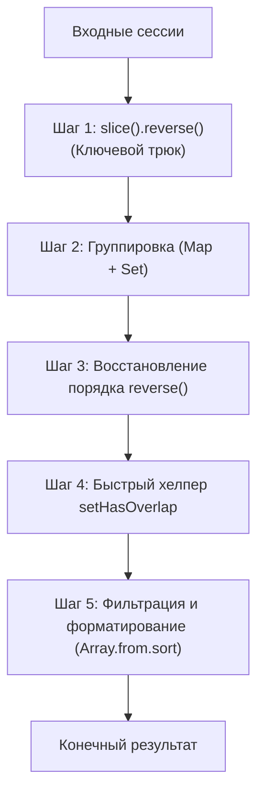

# 📚 Руководство по изучению и эффективному запоминанию алгоритма `selectData`

Это практическое руководство создано для того, чтобы помочь вам выучить и восстановить алгоритм `selectData` на техническом собеседовании без необходимости зубрить строчки кода.

---

## 🧠 1. Методология эффективного запоминания

Простое чтение кода создает иллюзию знания. Чтобы закрепить алгоритм на уровне мышечной памяти, используйте следующие техники:

1. **Метод «Чистого Листа» (Active Recall):** 
   Никогда не подглядывайте в готовую реализацию во время тренировки. Если вы забыли шаг:
   * Перечитайте блок теории ниже.
   * Закройте теорию.
   * Вернитесь в файл [test.ts](file:///Users/alibek/WebstormProjects/interview/selectData/test.ts) и реализуйте его с нуля.
2. **Интервальные Повторения (Spaced Repetition):**
   * **Сессия 1:** Напишите алгоритм сегодня с подсказками по шагам.
   * **Сессия 2 (Завтра):** Напишите без подсказок. Объясняйте логику каждого шага вслух (как интервьюеру).
   * **Сессия 3 (Через 3 дня):** Напишите на скорость.
   * **Сессия 4 (Через неделю):** Контрольное воспроизведение.
3. **Блочная ментальная модель:**
   Воспринимайте алгоритм не как монолитный кусок кода, а как **5 независимых кубиков**, каждый из которых решает свою микро-задачу.

---

## 🗺️ 2. Ментальная карта алгоритма (5 блоков)



### 🔹 Шаг 1: Метод «Двойного реверса» (Главный инсайт)
* **Проблема:** При объединении сессий (`merge: true`), объединенный объект должен занять позицию **последнего хронологического вхождения** пользователя в исходном массиве.
* **Решение:** Если перевернуть массив в самом начале (`sessions.slice().reverse()`), то **последнее вхождение пользователя станет первым встреченным**. 
* **Результат:** Мы мержим все последующие вхождения в это «первое» встреченное. В конце мы переворачиваем результат обратно, и все элементы возвращаются на свои хронологически правильные места!

### 🔹 Шаг 2: Внутренние структуры данных
Нам нужно делать операции быстро, сохраняя сложность $O(N)$ или $O(N \log N)$ (при сортировке на выходе):
1. **`Map<userId, SessionWithSet>`:** Хранит ссылки на сессии-клоны. Позволяет за $O(1)$ проверять, встречался ли пользователь ранее, и мгновенно изменять его `duration` и `equipment`.
2. **`Set<string>`:** Поле `equipment` внутри обрабатываемого массива хранится как `Set`, что позволяет добавлять оборудование за $O(1)$ с автоматическим исключением дубликатов.
3. **Защита от мутаций:** Создавая клон новой сессии, всегда делайте глубокую копию поля `equipment`: `new Set(session.equipment)`, чтобы не менять входной массив сессий.

### 🔹 Шаг 3: Итерация по развернутому массиву (Merge Logic)
Проходим циклом `.forEach` по развернутому массиву:
* **Если `options.merge === true` и пользователь уже есть в `Map`:**
  * Получаем ссылку на сессию-клон из `Map` за $O(1)$.
  * Увеличиваем `duration` сессии-клона на `session.duration`.
  * Переносим всё оборудование текущей сессии в `Set` сессии-клона: `session.equipment.forEach(e => userSession.equipment.add(e))`.
* **Иначе (первое вхождение пользователя или `merge === false`):**
  * Создаем клон сессии с новым `Set` оборудования: `{ ...session, equipment: new Set(session.equipment) }`.
  * Если `merge` активен, регистрируем этот клон в `Map`.
  * Добавляем клон в массив `sessionsProcessed`.

### 🔹 Шаг 4: Восстановление порядка
* Разворачиваем обработанный массив обратно: `sessionsProcessed.reverse()`.

### 🔹 Шаг 5: Фильтрация и форматирование (Output)
1. Превращаем `options.equipment` в `Set` (назовем `optionEquipments`) для поиска за $O(1)$ вместо $O(M)$ во вложенном массиве.
2. Проходим по `sessionsProcessed` и отфильтровываем элементы (short-circuit logic):
   * `options.user !== undefined && options.user !== session.user` $\rightarrow$ `return`
   * `options.minDuration !== undefined && options.minDuration > session.duration` $\rightarrow$ `return`
   * `optionEquipments.size > 0 && !setHasOverlap(optionEquipments, session.equipment)` $\rightarrow$ `return`
3. Для прошедших фильтр сессий возвращаем форму публичного контракта: `equipment` конвертируем обратно в отсортированный массив строк через `Array.from(session.equipment).sort()`.

---

## ⚡ 3. Алгоритмическая оптимизация (Секрет на $O(1)$)

На собеседовании критически важно написать оптимальную функцию проверки пересечения множеств.
Вместо вложенных проверок на массивах, мы пишем функцию `setHasOverlap`:
* Мы итерируемся по **меньшему** множеству и проверяем наличие его элементов в **большем** множестве за $O(1)$ с помощью метода `.has()`.
* Это дает сложность $O(\min(|A|, |B|))$ вместо наивной сложности $O(|A| \cdot |B|)$ на массивах.

```typescript
function setHasOverlap<T>(setA: Set<T>, setB: Set<T>): boolean {
  // Выбираем меньшее по размеру множество для итерации
  const [smaller, larger] = setA.size < setB.size ? [setA, setB] : [setB, setA]
  for (const val of smaller) {
    if (larger.has(val)) return true
  }
  return false
}
```

---

## ⚠️ 4. Ловушки на собеседовании (Common Pitfalls)

| Ловушка | Почему это плохо? | Как избежать? |
| :--- | :--- | :--- |
| **Мутация входного массива** | Изменение оригинальных данных ломает логику внешнего кода. | Использовать `sessions.slice().reverse()` вместо прямого `reverse()` на исходном массиве. Делать `new Set(session.equipment)` для клонов. |
| **Поиск по массиву оборудования за $O(N \cdot M)$** | Медленно. Вызовет критику со стороны интервьюера. | Превращать `options.equipment` в `Set` и использовать `setHasOverlap`. |
| **Несортированное оборудование на выходе** | Нарушает контракт с тестами. | Не забывать вызывать `.sort()` при конвертации Set обратно в Array: `Array.from(set).sort()`. |
| **Пропуск проверок `undefined` и `null`** | Падение кода при отсутствии опций. | Проверять параметры с помощью опциональной цепочки (`options?.user != null`). |

---

## 🎯 5. Трекер изучения (Чек-лист для самопроверки)

- [ ] Я могу объяснить принцип "двойного реверса" своими словами за 30 секунд.
- [ ] Я знаю, зачем нужны `Map` и `Set` во внутренней структуре обработанных сессий.
- [ ] Я могу написать `setHasOverlap` за $O(\min(|A|, |B|))$.
- [ ] Я могу написать полный код `selectData` на листе бумаги/в блокноте без подсказок.
- [ ] Все тесты в [test.ts](file:///Users/alibek/WebstormProjects/interview/selectData/test.ts) успешно проходятся моей реализацией с первого раза.
