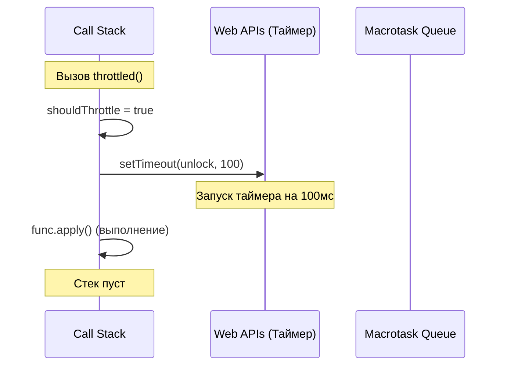

# Throttle — Разбор и Big O

---

## Что такое Throttle?

**Throttle** — техника ограничения частоты вызовов функции.

Если throttled-функцию вызывают несколько раз подряд, `func` выполняется **немедленно при первом вызове**, а все последующие вызовы в течение `wait` мс **игнорируются**. После истечения `wait` — следующий вызов снова выполнится немедленно.

**Аналогия:** турникет в метро. Пропускает — блокируется на N секунд — пропускает снова. Сколько бы раз ты ни прикладывал карту в период блокировки — ничего не произойдёт.

---

## Debounce vs Throttle

| | **Debounce** | **Throttle** |
|---|---|---|
| Когда вызывается func | После паузы в N мс | Немедленно, затем блокировка на N мс |
| Что происходит при повторных вызовах | Таймер сбрасывается | Вызовы игнорируются |
| Гарантия вызова | Только после остановки | Минимум раз в N мс |
| Хранит в замыкании | `timeoutID` | `shouldThrottle` (boolean) |
| Аналогия | Лифт ждёт всех пассажиров | Турникет блокируется после прохода |
| Применение | Поиск по мере ввода | Scroll, resize, rate-limit кнопок |

---

## Ключевая идея: булев флаг-замок

Throttle проще debounce — не нужно хранить `args` или `context` для отложенного вызова, потому что `func` вызывается **сразу**. Нужен только один флаг:

```
shouldThrottle = false  →  окно открыто, func выполнится
shouldThrottle = true   →  окно заблокировано, вызовы игнорируются
```

---

## TypeScript-типизация

### `ThrottleFunction<T>` vs generic по функции

В debounce использовали `T extends (...args: any[]) => any` — generic по всей функции.
Существует два основных способа типизировать функции высшего порядка (такие как `debounce` и `throttle`) в TypeScript. Рассмотрим их подробно, чтобы понять разницу.

### Способ 1: Generic по аргументам (через кортеж/tuple) — применен здесь

Этот подход используется в нашем `throttle`. Мы параметризуем только **типы аргументов** функции:

```ts
type ThrottleFunction<T extends any[]> = (this: any, ...args: T) => any

export function throttle<T extends any[]>(
  func: ThrottleFunction<T>,
  wait: number,
): ThrottleFunction<T>
```

- **Как это работает:** Если мы передаем функцию `(a: string, b: number) => void`, то TypeScript понимает, что `T` — это кортеж `[string, number]`.
- **Плюсы:**
  - Очень простая и чистая запись.
  - Нам не нужны вспомогательные типы вроде `Parameters<F>`.
  - Мы сразу работаем с массивом аргументов `T` напрямую.

---

### Способ 2: Generic по всей функции (как в debounce)

Этот подход часто встречается в сторонних библиотеках. Мы параметризуем **всю исходную функцию целиком**:

```ts
export function debounce<F extends (...args: any[]) => any>(
  func: F,
  wait: number,
): (...args: Parameters<F>) => void
```

- **Как это работает:** `F` захватывает весь тип переданной функции, например `(query: string) => Promise<void>`.
- **Чтобы получить типы её аргументов**, нам приходится использовать встроенный в TS служебный тип `Parameters<F>`.
- **Плюсы:**
  - Позволяет при необходимости сохранить/использовать тип возвращаемого значения исходной функции (`ReturnType<F>`). Хотя для асинхронного `debounce`/`throttle` это редко имеет смысл (так как они всегда возвращают `void`).

---

### Сравнение: какой подход выбрать?

| Критерий | Способ 1 (`T extends any[]`) | Способ 2 (`F extends (...args) => any`) |
|---|---|---|
| **Что типизируем** | Только аргументы (кортеж `T`) | Всю функцию целиком (`F`) |
| **Сложность синтаксиса** | Простой: `...args: T` | Сложный: `...args: Parameters<F>` |
| **Возврат оригинального типа** | Затруднительно (нужно вводить второй generic) | Легко: через `ReturnType<F>` |
| **Для чего лучше подходит** | Идеально для `throttle`/`debounce`, где возвращаемое значение всегда игнорируется (`void`) | Для функций-обёрток, которые должны возвращать результат работы оригинальной функции |

### Разбор сигнатуры обёртки `(this: any, ...args: T) => any`

- `this: any` — фиктивный параметр (в итоговом JS-коде его не будет). Он нужен только для TypeScript, чтобы разрешить вызов возвращаемой функции в контексте любого объекта (`obj.throttled()`) в строгом режиме `strictBindCallApply`.
- `...args: T` — rest-оператор, собирающий все переданные аргументы в массив, тип которого точно соответствует кортежу `T`.
- `any` в возвращаемом типе — указывает на то, что оригинальная функция может возвращать всё что угодно, но обёртка `throttle` это значение игнорирует (всегда возвращает `undefined` при вызове).

---

## Пошаговая трассировка

### Сценарий 1: базовый — вызов, блокировка, вызов

```
let i = 0
const throttledIncrement = throttle(() => i++, 100)

t =   0ms  →  throttledIncrement()
              shouldThrottle = false → не блокируем
              shouldThrottle = true  → закрываем окно
              setTimeout(unlock, 100)
              func.apply() → i++ → i = 1

t =  50ms  →  throttledIncrement()
              shouldThrottle = true → ИГНОРИРУЕМ, выходим
              i = 1  (не изменился)

t = 100ms  →  setTimeout срабатывает → shouldThrottle = false → окно открыто

t = 101ms  →  throttledIncrement()
              shouldThrottle = false → не блокируем
              shouldThrottle = true  → закрываем окно
              setTimeout(unlock, 100)
              func.apply() → i++ → i = 2
```

**Итог: i = 2** (два вызова за ~101мс вместо трёх)

---

### Сценарий 2: серия быстрых кликов на кнопку (rate-limit)

```
const saveForm = throttle(sendToServer, 2000)

t =    0мс  →  saveForm()  — shouldThrottle=false → sendToServer() вызван, окно закрыто
t =  300мс  →  saveForm()  — shouldThrottle=true  → ИГНОРИРУЕТСЯ
t =  600мс  →  saveForm()  — shouldThrottle=true  → ИГНОРИРУЕТСЯ
t =  900мс  →  saveForm()  — shouldThrottle=true  → ИГНОРИРУЕТСЯ
t = 2000мс  →  shouldThrottle=false → окно открыто
t = 2100мс  →  saveForm()  — shouldThrottle=false → sendToServer() вызван снова
```

**Результат:** 2 запроса вместо 5 за 2.1 секунды

---

### Сценарий 3: scroll-обработчик

```
const onScroll = throttle(updatePosition, 200)
window.addEventListener('scroll', onScroll)

t =   0мс  →  scroll → updatePosition() → shouldThrottle=true
t =  16мс  →  scroll → ИГНОРИРУЕТСЯ
t =  32мс  →  scroll → ИГНОРИРУЕТСЯ
...
t = 200мс  →  shouldThrottle=false
t = 216мс  →  scroll → updatePosition() → shouldThrottle=true
```

Браузер стреляет scroll ~60 раз/сек (каждые 16мс). С throttle 200мс — 5 вызовов/сек вместо 60.

---

## Разбор кода с комментариями

```ts
type ThrottleFunction<T extends any[]> = (this: any, ...args: T) => any
// T extends any[] — T это tuple аргументов: [string] или [number, boolean] и т.д.
// (this: any) — фиктивный параметр, разрешает любой this в strict-режиме
// ...args: T  — аргументы с типом tuple T
// => any      — возвращаемое значение не важно (throttle его игнорирует)
```

```ts
export function throttle<T extends any[]>(
  func: ThrottleFunction<T>,
  wait: number,
): ThrottleFunction<T> {
// Возвращаем функцию с точно той же сигнатурой что и func
// T выводится автоматически из переданного func
```

```ts
  let shouldThrottle = false
  // Единственная переменная замыкания — булев флаг
  // false = окно открыто | true = окно заблокировано
  // В отличие от debounce — не храним timeoutID, args, context
  // (func вызывается сразу, откладывать нечего)
```

```ts
  return function (this: any, ...args: T) {
  // Обычная function — НЕ стрелка
  // this определяется в момент вызова снаружи
  // Стрелка зафиксировала бы this навсегда при создании throttle
```

```ts
    if (shouldThrottle) {
      return
    }
    // Ранний выход — самое важное в throttle
    // Никакого setTimeout, никакого сохранения args — просто игнорируем вызов
```

```ts
    shouldThrottle = true
    setTimeout(function () {
      shouldThrottle = false
    }, wait)
    // Сначала закрываем окно, потом вызываем func
    // Порядок важен: если func бросит исключение — окно уже закрыто
    // setTimeout внутри — обычная function, this не нужен (только меняем флаг)
```

```ts
    func.apply(this, args)
    // apply(this, args) — единственный способ передать и this и args вместе
    // func(..args) — потеряет this
    // func.call(this, args[0], args[1]...) — громоздко при неизвестном числе аргументов
```

---

## React: реальные примеры

### Паттерн 1 — throttle scroll-обработчика через useEffect

```tsx
function ScrollTracker() {
  const [scrollY, setScrollY] = useState(0)

  useEffect(() => {
    // throttle создаётся один раз внутри useEffect
    const handleScroll = throttle(() => {
      setScrollY(window.scrollY) // обновляем state не чаще раза в 200мс
    }, 200)

    window.addEventListener('scroll', handleScroll)

    // cleanup: снимаем тот же обработчик что добавили
    // важно: handleScroll — та же ссылка (замыкание useEffect), removeEventListener найдёт её
    return () => window.removeEventListener('scroll', handleScroll)
  }, []) // [] — создаём и удаляем обработчик один раз

  return <div>Scroll Y: {scrollY}</div>
}
```

**Трассировка scroll:**
```
рендер     → useEffect: throttle создан, addEventListener
scroll↓    → handleScroll() → shouldThrottle=false → setScrollY(120) → shouldThrottle=true
scroll↓    → handleScroll() → shouldThrottle=true  → ИГНОРИРУЕТСЯ
scroll↓    → handleScroll() → shouldThrottle=true  → ИГНОРИРУЕТСЯ
+200мс     → shouldThrottle=false
scroll↓    → handleScroll() → setScrollY(480) → shouldThrottle=true
unmount    → removeEventListener(handleScroll)
```

---

### Паттерн 2 — throttle кнопки отправки формы (rate-limit)

```tsx
function SubmitButton({ onSubmit }: { onSubmit: () => void }) {
  // useRef — храним throttled-функцию между рендерами без ререндера
  // useCallback не подходит: throttle создаёт внутреннее состояние (shouldThrottle),
  // пересоздание при каждом рендере сбросит флаг
  const throttledSubmit = useRef(
    throttle(() => {
      onSubmit()
    }, 2000) // не чаще раза в 2 секунды
  ).current

  return (
    <button onClick={throttledSubmit}>
      Отправить
    </button>
  )
}
```

**Трассировка — пользователь дважды кликает быстро:**
```
клик t=0мс    → throttledSubmit() → onSubmit() → shouldThrottle=true
клик t=50мс   → throttledSubmit() → shouldThrottle=true → ИГНОРИРУЕТСЯ
t=2000мс      → shouldThrottle=false → можно снова
клик t=2100мс → throttledSubmit() → onSubmit() → shouldThrottle=true
```

**Почему `useRef`, а не `useMemo` или `useCallback`?**
- `useMemo` — может пересчитаться (React не гарантирует стабильность)
- `useCallback` — пересоздаёт функцию при изменении deps, сбрасывает `shouldThrottle`
- `useRef` — `.current` никогда не меняется после первого присвоения

---

### Паттерн 3 — throttle resize через useThrottle хук

```tsx
// Переиспользуемый хук — аналог useDebouncedValue но для throttle
function useThrottledValue<T>(value: T, wait: number): T {
  const [throttledValue, setThrottledValue] = useState(value)
  // useRef хранит throttled-сеттер — не пересоздаётся при рендере
  const setter = useRef(
    throttle((v: T) => setThrottledValue(v), wait)
  ).current

  useEffect(() => {
    setter(value) // при каждом новом value — пробуем обновить (throttle сам решит)
  }, [value])

  return throttledValue
}

// Использование:
function ResizeAwareComponent() {
  const [windowWidth, setWindowWidth] = useState(window.innerWidth)

  useEffect(() => {
    const handleResize = () => setWindowWidth(window.innerWidth)
    window.addEventListener('resize', handleResize)
    return () => window.removeEventListener('resize', handleResize)
  }, [])

  // windowWidth меняется на каждый пиксель resize — throttledWidth не чаще раза в 300мс
  const throttledWidth = useThrottledValue(windowWidth, 300)

  return <div>Ширина (throttled): {throttledWidth}px</div>
}
```

### Паттерн 4 — Отправка аналитики скролла на сервер (Scroll Analytics API)

Представим реальную задачу: мы хотим отправлять на наш сервер данные о глубине скролла страницы (например, в процентах), чтобы понимать, дочитывают ли пользователи наши статьи до конца.

#### Проблема без `throttle`
Если навесить обычный обработчик скролла и делать внутри `fetch`-запрос, то при скролле страницы браузер будет вызывать его **каждые 10-16 миллисекунд** (до 60-100 раз в секунду). Это приведет к:
1. Сотням лишних сетевых запросов за пару секунд.
2. Огромной нагрузке на наш сервер (DDoS собственного бэкенда).
3. Подвисанию интерфейса у пользователя из-за перегрузки основного потока.

#### Решение с `throttle`
Мы оборачиваем отправку в `throttle(sendAnalytics, 1500)`. Теперь:
1. Пользователь скроллит $\rightarrow$ первый же сдвиг скролла **мгновенно** отправляет первый запрос на сервер.
2. В течение следующих **1.5 секунд** скролл продолжается, но любые вызовы обработчика **полностью игнорируются**.
3. Спустя 1.5 секунды окно открывается снова. Следующий скролл мгновенно отправит свежую координату на сервер и закроет окно еще на 1.5 секунды.

#### Простой и понятный код компонента в React

```tsx
import React, { useEffect, useRef } from 'react';
import { throttle } from './throttle';

export function ArticleReader({ articleId }: { articleId: string }) {
  
  // 1. Создаем функцию отправки на сервер
  const sendScrollAnalytics = async (percent: number) => {
    console.log(`📡 Отправка на сервер: скролл ${percent}% для статьи ${articleId}`);
    try {
      await fetch('/api/analytics/scroll', {
        method: 'POST',
        headers: { 'Content-Type': 'application/json' },
        body: JSON.stringify({ articleId, percent: Math.round(percent) })
      });
    } catch (error) {
      console.error('Ошибка отправки аналитики:', error);
    }
  };

  // 2. Оборачиваем функцию в throttle и сохраняем в useRef.
  // Зачем useRef? Компонент React может рендериться много раз.
  // Если объявить throttle просто в useEffect или хуке useCallback, то при рендере 
  // функция throttle может пересоздаться, сбросив состояние shouldThrottle в false.
  // useRef гарантирует, что у нас всегда будет ОДНА стабильная throttled-функция.
  const throttledSendAnalytics = useRef(
    throttle((percent: number) => {
      sendScrollAnalytics(percent);
    }, 1500) // отправляем не чаще раза в 1.5 секунды
  ).current;

  // 3. Подписываемся на скролл внутри useEffect
  useEffect(() => {
    const handleScroll = () => {
      // Вычисляем процент прокрутки страницы
      const scrollTop = window.scrollY; // сколько прокручено вверх
      const docHeight = document.documentElement.scrollHeight; // полная высота документа
      const winHeight = window.innerHeight; // высота окна браузера
      const scrollPercent = (scrollTop / (docHeight - winHeight)) * 100;

      // Вызываем throttled-функцию. 
      // Она сама решит: пропустить вызов дальше или проигнорировать
      throttledSendAnalytics(scrollPercent);
    };

    window.addEventListener('scroll', handleScroll);

    // Убираем слушатель при размонтировании компонента (cleanup)
    return () => {
      window.removeEventListener('scroll', handleScroll);
    };
  }, [throttledSendAnalytics]); // эффект зависит только от стабильной ссылки из useRef

  return (
    <article style={{ padding: '20px', lineHeight: '1.6' }}>
      <h1>Очень интересная статья</h1>
      <p>... много-много текста для прокрутки ...</p>
    </article>
  );
}
```

```

#### 1. Глубокий разбор: `useRef(throttle(...))` и передача функции как параметра

Запись `const throttled = useRef(throttle(...)).current` часто вызывает вопросы у тех, кто привык использовать `useRef` только для доступа к DOM-элементам. Разберем, как это работает.

##### Как `useRef` хранит любые значения?
В React `useRef` — это просто коробка (объект с единственным свойством `{ current: value }`), которая переживает любые ререндеры компонента. В отличие от локальных переменных, значение в `useRef` не сбрасывается. В отличие от `useState`, изменение `useRef` не вызывает новый рендер компонента.
Поскольку функции в JavaScript являются объектами первого класса (их можно записывать в переменные, передавать аргументами и возвращать), мы можем положить в `useRef` абсолютно всё:
*   Числа (например, счетчик таймера `useRef(0)`)
*   Экземпляры классов (`useRef(new Client())`)
*   **И, конечно, функции** — в нашем случае функцию, которую вернул вызов `throttle(...)`.

##### Важный подводный камень: «холостая» инициализация
Когда мы пишем:
```tsx
const throttledSendAnalytics = useRef(
  throttle(sendScrollAnalytics, 1500)
).current;
```
React инициализирует `useRef` **только при самом первом рендере** компонента. При последующих рендерах React игнорирует переданный аргумент и возвращает уже сохраненную в `.current` ссылку.
**Но сам JavaScript вычисляет аргументы функции до ее вызова!** Это означает, что при каждом рендере компонента выражение `throttle(...)` будет заново выполняться, создавая новую внутреннюю функцию с замыканием флага `shouldThrottle`. Хотя React сразу же выбросит этот новый результат и вернет старый, ресурсы CPU все равно тратятся впустую на создание «холостых» функций.

##### Как это решить? Паттерн ленивой (Lazy) инициализации `useRef`
Если функция инициализации "тяжелая", лучшей практикой является создание ссылки один раз через проверку на `null`:
```tsx
// 1. Создаем пустой ref
const throttledRef = useRef<ReturnType<typeof throttle> | null>(null);

// 2. Инициализируем только один раз, если он пустой
if (!throttledRef.current) {
  throttledRef.current = throttle(sendScrollAnalytics, 1500);
}

// 3. Достаем стабильную функцию
const throttledSendAnalytics = throttledRef.current;
```
*В таком случае `throttle(...)` гарантированно вызовется ровно 1 раз за всю жизнь компонента.*

---

#### 2. Разбор математики скролла в браузере

Математика расчета процента скролла выглядит так:
```ts
const scrollTop = window.scrollY; // сколько прокручено вверх
const docHeight = document.documentElement.scrollHeight; // полная высота документа
const winHeight = window.innerHeight; // высота окна браузера
const scrollPercent = (scrollTop / (docHeight - winHeight)) * 100;
```

Разберем каждое значение простыми словами:

*   `window.scrollY` (или `scrollTop` для локального контейнера):
    Это расстояние в пикселях от самого верха страницы (или контейнера) до текущей верхней границы видимой области экрана.
    *   Когда вы находитесь на самом верху страницы, `scrollY === 0`.
    *   Когда вы прокручиваете страницу вниз, это значение растет.
*   `document.documentElement.scrollHeight` (или `element.scrollHeight`):
    Это **полная высота всего содержимого** страницы (включая то, что сейчас скрыто внизу за пределами экрана и требует прокрутки).
*   `window.innerHeight` (или `element.clientHeight`):
    Это высота **видимой части** окна браузера (viewport), которую вы видите своими глазами на экране прямо сейчас.

##### Почему мы делим `scrollTop` на `(docHeight - winHeight)`?
Пользователь физически не может прокрутить страницу до тех пор, пока верхняя граница видимой области не сравняется с самым низом документа. 
Когда пользователь прокрутит страницу до самого конца, верхняя граница экрана остановится на расстоянии `docHeight - winHeight`. Дальше крутить некуда, так как нижний край страницы упрется в нижний край экрана.
Следовательно:
*   Минимальный скролл (`scrollTop`) = `0`
*   Максимально возможный скролл (`scrollTop`) = `docHeight - winHeight` (Полная высота содержимого минус высота экрана)

Деля текущее положение `scrollTop` на максимально возможный диапазон `docHeight - winHeight`, мы получаем дробь от `0.0` (начало) до `1.0` (конец). Умножаем на `100` и получаем точный процент прокрутки!

---

#### 3. Почему не во всех примерах используется кастомный хук?

В коде вы видите два разных паттерна использования `throttle`:
1.  **Кастомный хук:** `const throttledWidth = useThrottledValue(windowWidth, 300)`
2.  **Прямой вызов через `useRef`:** `const throttledSubmit = useRef(throttle(...))`

##### Разница в целях использования:

*   **Хук `useThrottledValue` — для сдерживания ЗНАЧЕНИЙ (State/Props)**
    Мы используем хук, когда у нас есть **уже меняющееся реактивное значение** (например, стейт `windowWidth`, который меняется при ресайзе), и мы хотим получить его "замедленную" копию, чтобы использовать её при рендере.
    *   *Принцип:* «Значение меняется слишком быстро $\rightarrow$ дай мне его замедленную копию для JSX».
*   **Связка `useRef(throttle(...))` — для сдерживания ДЕЙСТВИЙ (Событий/API-запросов)**
    Мы используем прямой `useRef` для создания стабильного **обработчика событий** (клик по кнопке, отправка аналитики на сервер при скролле). Нам не нужно замедлять рендер какого-то текста; нам нужно, чтобы при вызове колбэка он не слал запросы слишком часто.
    *   *Принцип:* «Пользователь кликает/скроллит слишком часто $\rightarrow$ заблокируй лишние вызовы обработчика».

Именно поэтому для клика и скролла мы используем прямой `useRef`, а для отображения ширины окна на экране — кастомный хук.

---

### Интерактивный интерактивный стенд в React

Все эти три примера реализованы в виде живого визуального интерфейса в проекте. Исходный код находится в файле [ThrottleExamples.tsx](file:///Users/alibek/WebstormProjects/interview/react-tasks/data-table/src/ThrottleExamples.tsx).

Особенности реализации для наглядности:
1. **Scroll Tracker**: 
   - Использует прокрутку внутри локального контейнера-списка вместо `window`.
   - Выводит два счётчика: реальное количество сработавших событий скролла от браузера (сотни событий за пару секунд) и количество вызовов обработчика, пропущенных через `throttle(..., 200)`.
2. **Submit Button**:
   - Кнопка с ограничением кликов раз в `2000мс`.
   - Выводит интерактивный лог событий в реальном времени. Разрешённые запросы помечаются зелёным цветом (`✅ Запрос отправлен`), а заблокированные спам-клики — полупрозрачным красным цветом (`❌ Проигнорировано (throttle)`).
3. **Resize Tracker**:
   - Отслеживает изменение ширины окна браузера через `windowWidth` и `useThrottledValue(windowWidth, 300)`.
   - Дополнительно рендерит интерактивный ресайз-блок с CSS свойством `resize: horizontal`. Пользователь может менять ширину блока мышкой и видеть, как значение реальной ширины меняется мгновенно на каждый пиксель движения, а throttled-значение обновляется ступенчато с шагом в `300мс`.

---

---

## Throttle и Event Loop (Цикл событий)

Для глубокого понимания работы `throttle` важно разобрать, как его выполнение распределяется по структурам **Event Loop** (стек вызовов, очереди задач и внешнее окружение).

### Участники процесса

1. **Call Stack (Стек вызовов)** — место, где синхронно выполняется весь JavaScript-код (в один поток).
2. **Web APIs (Браузерное окружение / C++ Node.js)** — фоновые потоки, которые обрабатывают асинхронные операции, такие как таймеры (`setTimeout`), сетевые запросы или слушатели событий.
3. **Macrotask Queue (Очередь макрозадач)** — очередь, куда Web API помещает колбэки от сработавших таймеров (`setTimeout`, `setInterval`), событий и т.д.
4. **Microtask Queue (Очередь микрозадач)** — высокоприоритетная очередь для промисов (`Promise.then/catch/finally`, `queueMicrotask`). Очищается полностью перед любым рендером или следующей макрозадачей.

---

### Пошаговый жизненный цикл в Event Loop

Допустим, мы вызвали `throttled()` в момент времени `t = 0` с интервалом `wait = 100` мс.

#### Шаг 1: Синхронная фаза (Первый вызов)
1. Вызов `throttled()` попадает в **Call Stack**.
2. Проверяется `shouldThrottle` (сейчас `false`, так как окно открыто).
3. `shouldThrottle` устанавливается в `true` (закрываем окно).
4. Вызывается `setTimeout(unlock, 100)`.
   - Вызов `setTimeout` выполняется синхронно и мгновенно уходит из Call Stack.
   - Браузерное окружение (**Web API**) регистрирует таймер на `100` мс и начинает обратный отсчет в фоновом потоке.
5. Вызывается оригинальная функция `func.apply(this, args)`. Она помещается на вершину **Call Stack** и выполняется синхронно.
6. Выполнение `func` завершается, она удаляется из стека.
7. Функция `throttled` завершается и также удаляется из **Call Stack**. Стек пуст.



#### Шаг 2: Период блокировки (Вызовы во время wait)
Если в интервале от `0` до `100` мс происходит повторный вызов `throttled()`:
1. Вызов попадает в **Call Stack**.
2. Проверяется `shouldThrottle`. Так как оно равно `true`, срабатывает условие `if (shouldThrottle) return`.
3. Функция мгновенно завершается и удаляется из **Call Stack**.
4. Никаких новых таймеров не регистрируется, оригинальная функция `func` не вызывается.

#### Шаг 3: Срабатывание таймера и разблокировка
1. Через `100` мс фоновый таймер во **Web API** завершает работу.
2. Web API переносит колбэк `unlock` (который делает `shouldThrottle = false`) в **Macrotask Queue**.
3. **Event Loop** непрерывно проверяет состояние **Call Stack**.
4. Как только **Call Stack** освобождается и очищается очередь микрозадач (Promise), Event Loop забирает колбэк `unlock` из **Macrotask Queue** и помещает его в **Call Stack**.
5. Колбэк выполняется: `shouldThrottle` меняется на `false`.
6. Окно открыто, следующий вызов `throttled()` снова пойдет по пути **Шага 1**.

```mermaid
sequenceDiagram
    participant WebAPI as Web APIs (Таймер)
    participant Macro as Macrotask Queue
    participant Loop as Event Loop
    participant Stack as Call Stack

    Note over WebAPI: Прошло 100мс
    WebAPI->>Macro: Перенос колбэка unlock в очередь
    Note over Loop: Проверка: пуст ли Call Stack?
    Loop->>Stack: Push unlock() из очереди макрозадач
    Note over Stack: Выполнение: shouldThrottle = false
    Note over Stack: Стек пуст. Окно открыто!
```

---

## Big O

### Временная сложность: `O(1)` на каждый вызов

| Операция | Сложность |
|----------|-----------|
| Проверка `shouldThrottle` | `O(1)` |
| `setTimeout` | `O(1)` |
| `func.apply` | `O(1)` + сложность `func` |
| Итого на вызов | **`O(1)`** |

### Пространственная сложность: `O(1)`

Одна булева переменная `shouldThrottle` — не зависит от количества вызовов.
